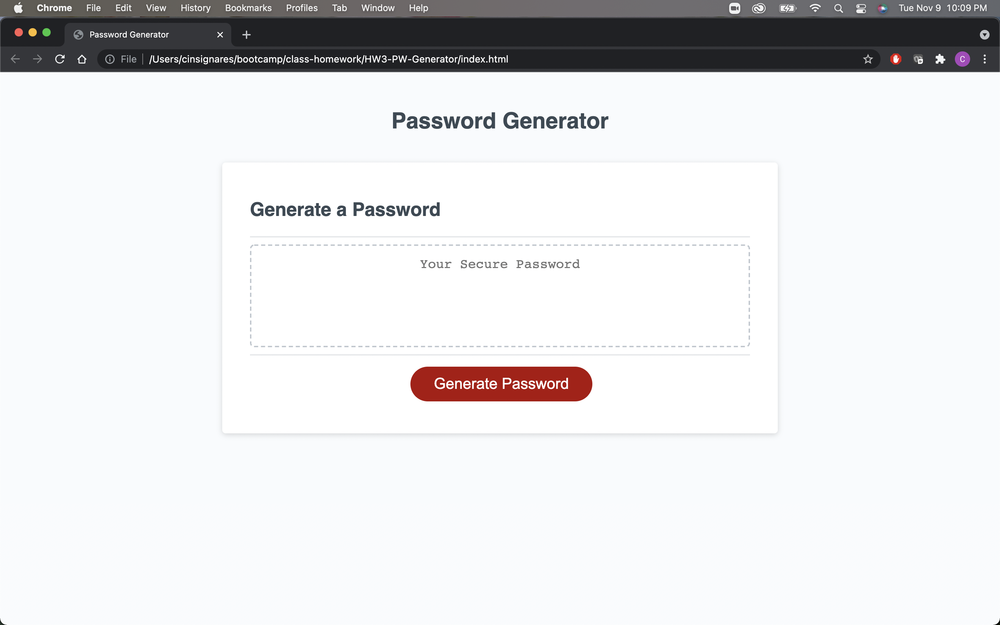
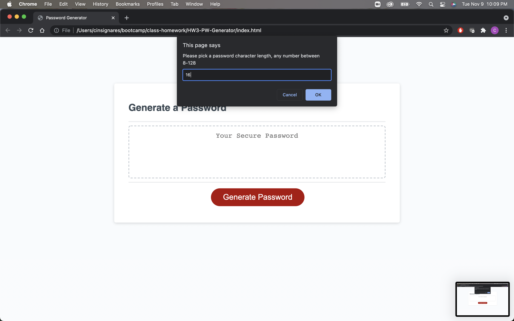
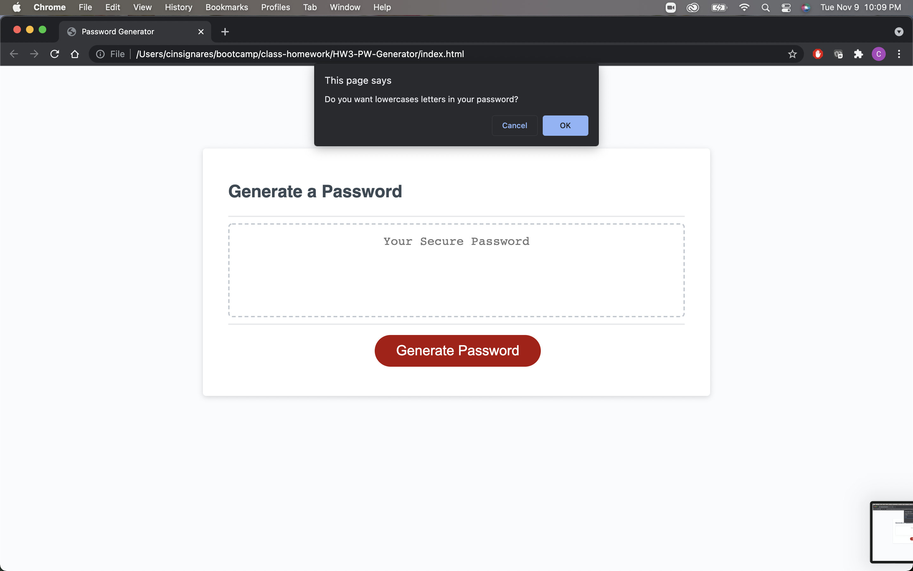
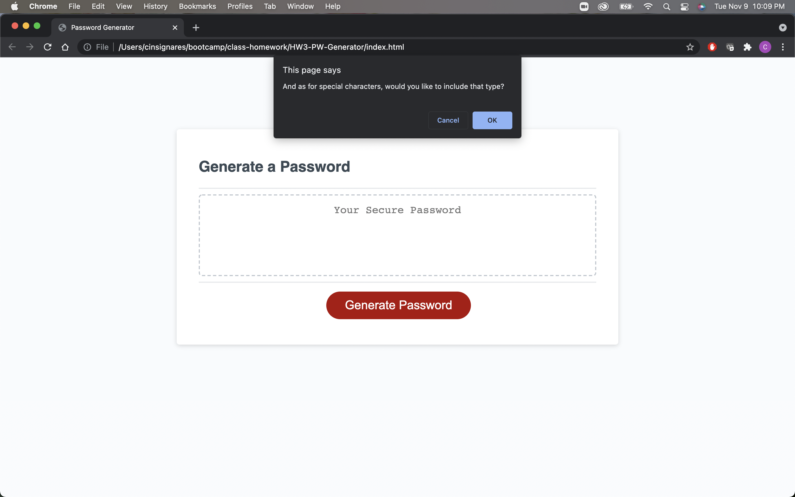
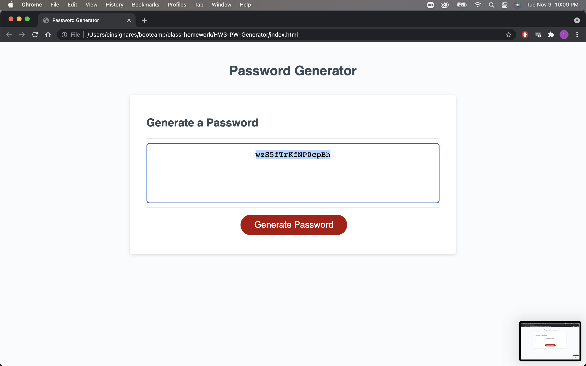

# Password Generator

## Description

The idea is to create a new password with randomized letters, numbers, or even special characters to complete a safe and randomized password.

## Installation

The repo is uploaded to github at the link https://github.com/ChrisIgg/HW-3-Password-Generator and is accessible at the url link https://chrisigg.github.io/HW-3-Password-Generator/.

## Usage

The following images may help:

